# Folding-kayak

Build logs and instructions for making your folded origami kayaks from sheet of polypropylene plastic sheets. Original concept invented by [Aslag Guttormsgaard:](https://www.instagram.com/aslagsbrettekajakk/)

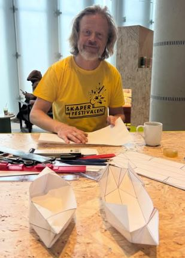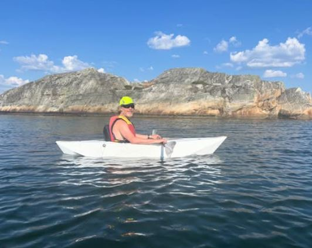

# Description

It is possible to fold a kayak from a plastic sheet that is ultralight and packs up to a flat package. Read on to learn how.

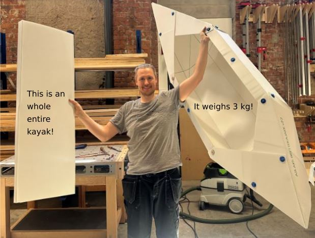

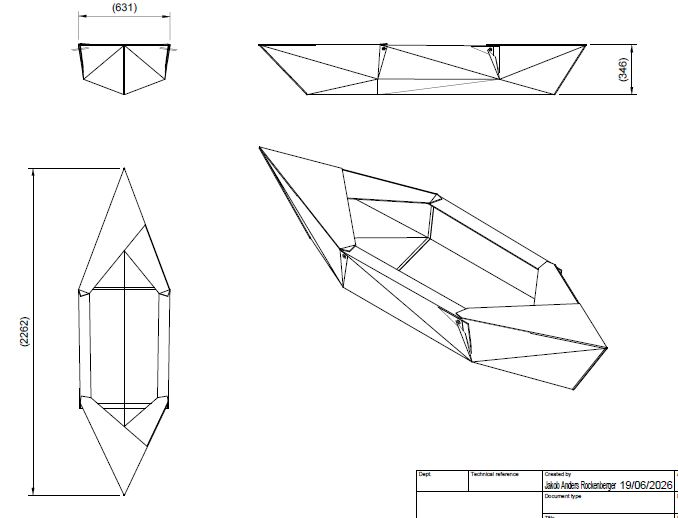

It packs up to approximately 1220x500x50mm and weighs 3kg total without paddles.

Packing up or down took around 15 minutes each for my first time, [the inventor can assemble his in 4 min!](https://www.instagram.com/p/DQYdUIIiCEW/)

## Who? Where?
We are a group of five Makers based in Oslo Norway attempting to make, improve and share Aslags fantastic kayak design! 

We are working out of the shared workshop [Fellesverkstedet](https://www.fellesverkstedet.no/) and they have been incredibly helpful in procuring the materials needed for the project. We are also making use of Norways biggest Makerspace: [Bitraf](https://bitraf.no/), for 3D -printing the fasteners.

### Production status

We are attempting to make 5 kayaks out of 9 sheets of polypropylene

| Sheet | Use | Status |
| ----- | --- | ------ |
| 1     |Seat for Kayak 1 + test| Used up |
| 2     |Kayak 1 v2.2| Used up |
| 3     |Kayak 2 v2.2| Creased and (over?)cut |
| 4     |Kayak 3 v2.2| Creased and cut |
| 5     |Kayak 4 v2.2| Painted, convert to v2.3! |
| 6     |Kayak 5 v2.3| Reserved, not started |
| 7     |Seats for 2-3 v2.3| Reserved, not started |
| 8     |Seats for 4-5 v2.3| Reserved, not started |
| 9     | Spare|   |

Sheet 9 options:
- Spare kayak if one goes bad. 
- Opgrade to Seat v2.3 for kayak4 if needed 
- Other details, like triangles for under the pilot seat.

### BOM:
- 2440mm x 1220mm fluted / internally corrugated polypropylene sheet - 4mm thickness 700g/m^2 - 1.5pcs / Kayakk ([Antalis supplier](https://www.antalis.no/eshop/medier-og-utstyr-for-visuell-kommunikasjon/plater/kanalplast-pp-pdp-hq08108/sku-694530#))
- M5 hex head screws 30mm length - About 20pcs
- M5 nuts - About 20pcs
- Filament for 3D printing lock washers

# Todo

- Print more fasteners for all kayaks!
- Fold and bolt kayaks 2 & 3 main bodies that are already creased to v2.2 specifications
- Make seat-inlays v2.3 for finsihed kayak bodies to amend inversion problems
- Adjust painted lines and crease kayak 4 to v 2.3 specifications: "pack up" lines should be moved.
- Make a seat v2.3 for kayak 1, and give the used kayak 1 seat inlay v2.2 to kayak 4, test both kayaks. This should give good data both ways. 
- Paint and crease kayak 5 main body 
- Make and a seat for kayak 5, v2.3 or v2.2 depending on data from test.
- Find and test a folding beach chair without legs as a pilots seat to give back support. The PHOXX ones with inflateable seats looked promising but seems to be discontinued. Similiar product: [Falkeberg Ground Chair](./Images/ground_chair.JPG)
- Document our cresing adn folding process with pictures
- Document fasteners and crease rollers
- Develop version 3.0 of the folding kayak 

## Folding strategy

1. Mark where you want to fold your sheet
2. Heat the plastic to 150C
3. Crease it with a wooden roller, aproximatly 10 mm wide, Ø30mm with rounded edges.
4. Use a board or something stiff under the sheet when you lift it, to help get straight folds

# Version history and test log

## Version 3

Is under delvelopment using a sheet metal model, see [tests for establishing k-value and new approximated sheetmetal model](sheet_metal_theory.md)

## Version 2.3

The version we are currently making.

 These tweaks aim to stiffen the kayak further and avoid the innvards collapses. 
 
 - This update tries out several things, possibly overcomplicating the design. Some of these fixes might be enough on their own. 
 - We should tape up the open edges of the sheet with silver-tape. It will give it around 10 liters of trapped air for lift in an emergency and reduce cuts and scrapes. Especially on the sides of the cockpit.

### Change log 

- Extend the seat-inlay to use half a full sheet of polypropylene 1220X1220 = more bending, lots more dimensjons
- Move the "pack up lines" to intersect with other lines. 
- Slope the cockpit sides innward to make the bends sharper in the nose and rear. This means cutting more from the corners, how much? Freehand? possibly not needed? Can we achieve the same thing some other way?

### Drawings

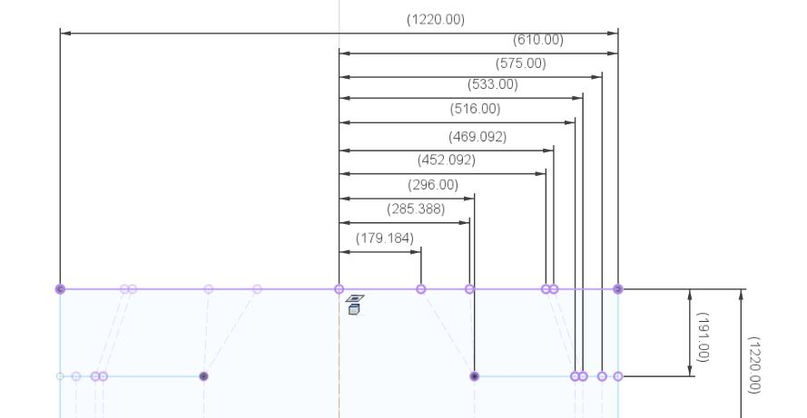

[PDF Brettekajakk v2.3 pack_up lines only](./Drawings/Brettekajakk_pack_up_lines_v2.3.pdf)

[DXF seat v2.3](./Router-plot-DXF/Seat_v2.3_DXF.dxf)

[DXF kayak main file v2.3](./Router-plot-DXF/Brettekayak_JR_v2.3.dxf)

## Version 2.2

### Test results and impressions

June 22 2026 - Jakob Rockenberger at Vesletjern

 It handles OK. Not fast not very rank or very stable. Tracks fine, not very fast. Survived some banging and grinding on rocks. Since it lacks sealed air chambers it's not something I'd risk the open seas with, but prefect for exploring a lake or a creek where you can swim to shore if you need it. The main advantage is that you can easily pack it up and take a bus home afterwards. I weigh 75kg and paddled easily around a small lake together with my 5 year old! 
 
 I sat on a foam mat with a rolled up towel underneath to let the boat keep the V shape in the bottom. We can possibly make a triangle from leftover material that we can use instead if we have enough. 

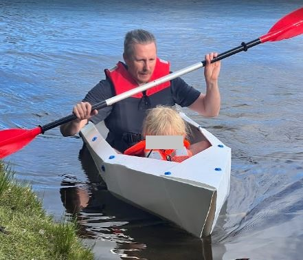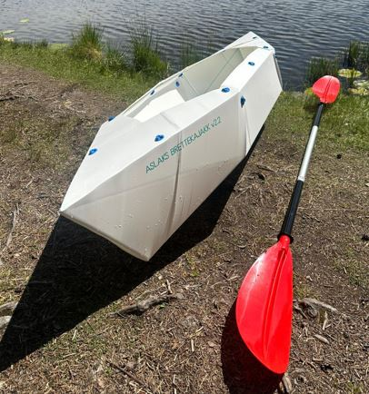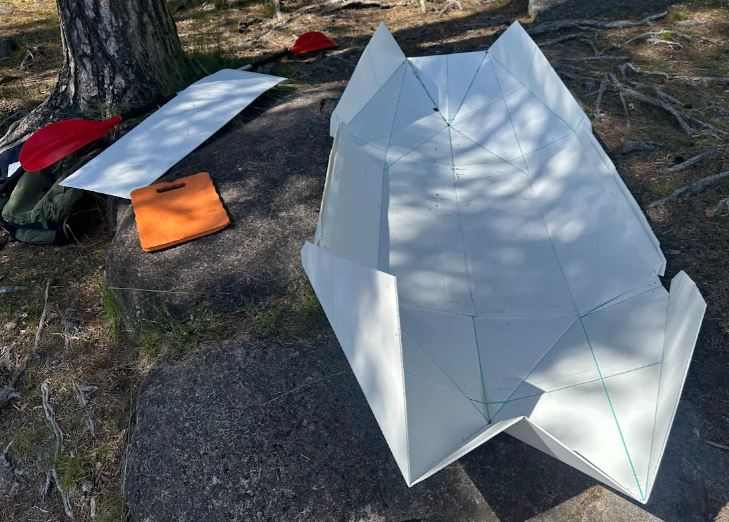

#### Inversions

- The kayak experienced some innvards local "collapses" of the shape of the Kayak, surfaces that should be convex became concave, when they were pushed in by the water-pressure. This happend in the bottom area under my calves and behind me from both sides. 
- Note that the kayak didn't become unsafe when this happened! When the bottom front inverted, the sideways stabiliy increased as well as the drag. I didn't notice the rear inverting until later, but I assume I lost some boyancy, forcing me to sit more to the front
- I think the reasons was the "pack up" folds, in this version they didn't intersect existing geometry. This can easily be changed in next version.
- Two more kayaks has already been creased with these unfortunate "pack up" folds, and we want to finish them regardless.
- Several potential fixes will be tested in version 2.3. 

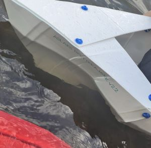

### Change log and notes

- The drawings now include previously missing and corrected dimesions for how much to cut off the corners.
- Bend lines for packing up (missing from the PDF drawing) are placed such a way in the DXF that it folds nice and small, around 400mm wide package.
- The bend lines for packing up appear to make it weaker. Consider moving them to natural intersection-points. 
- Was assembled and tested with vertical sides to the cockpit, it is possible that it would be stronger if they were curved in a bit. Intended in v2 original design?

### Drawings 

This is the drawing for version 2.3. Solid modeld recreated in Fusion360 by Jakob from Aslags drawings. 

[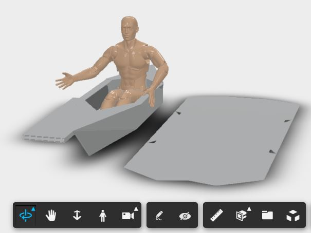](https://a360.co/4fWsus3)

[*Interactive 3d-model of the kayakk*](https://a360.co/4fWsus3)

[PDF Drawing for version 2.2, without "pack up lines"](./Drawings/Drawing_v2.2.pdf)

[DXF version, with "pack up bend lines"](./Router-plot-DXF/Brettekayak_JR_v2.2.dxf)

## Folding Kayak Aslagstyle - Brettekajakk Aslagstyle v1.0 and V2.0
Invented by [Aslag Guttormsgaard](https://www.instagram.com/aslagsbrettekajakk/) and shared with the public at [Oslo Skaperfestival 25. - 26. oktober 2025](https://deichman.no/aktuelt/oslo-skaperfestival-2025_D67nCl3o7T) ([Alt. link](https://skaperfestivalen.no/)). Attendies could fold their own mini kayaks from printouts on A4 paper. Aslag exibited his model 1 and 2 at the festival.

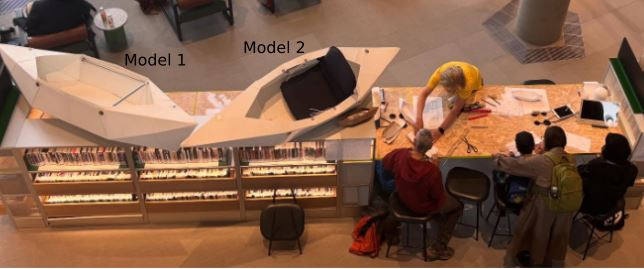

### Drawings 

#### Version 2.0 

This is the drawing for version 2.0. Changes from the previous version is that it has the added railing to rest your hands on. Don't mind that the text in the drawing says model 3.

[Drawing for version 2.0](./Drawings/Aslag_Kajakk_modell_2.pdf)

#### Version 1.0 

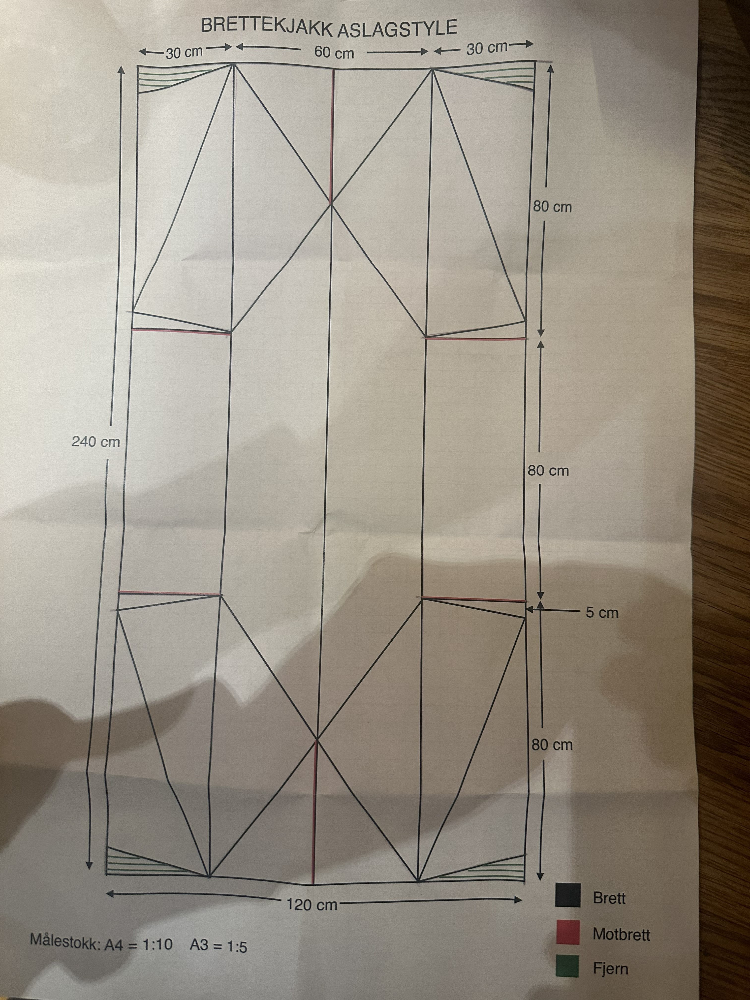

Paper handout of version 1.0 from Oslo Maker Festival

