# Folding-kayak

Build logs and instructions for making your folded origami kayaks from sheet of polypropylene plastic sheets. Original concept invented by [Aslag Guttormsgaard:](https://www.instagram.com/aslagsbrettekajakk/)

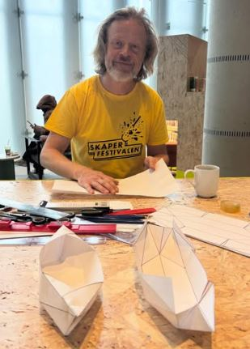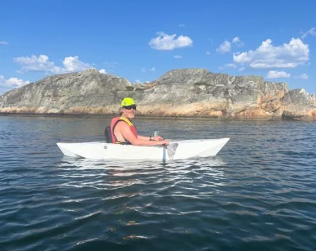

# What is it?

A do it yourself kayak, made from a plastic sheet that is ultralight and packs up to a flat package. Read on to learn how.

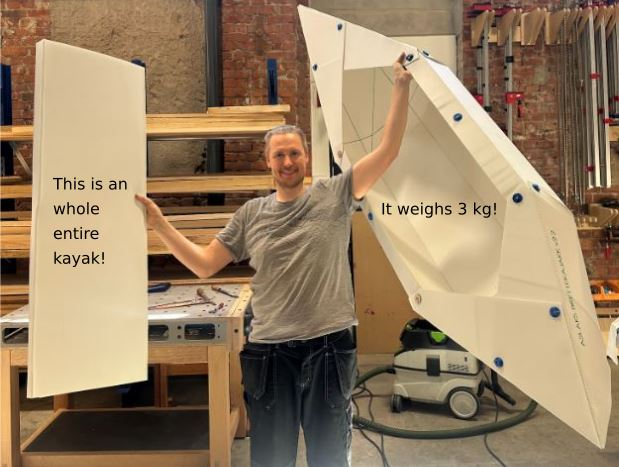

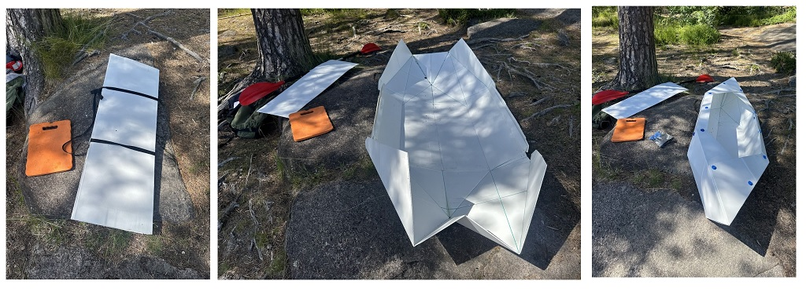

It packs up to approximately 1220x500x50mm (left picture) and weighs 3kg total without paddles. Packing up or down took around 15 minutes each for my first time, [the inventor has the record with a 4 min assembly!](https://www.instagram.com/p/DQYdUIIiCEW/)

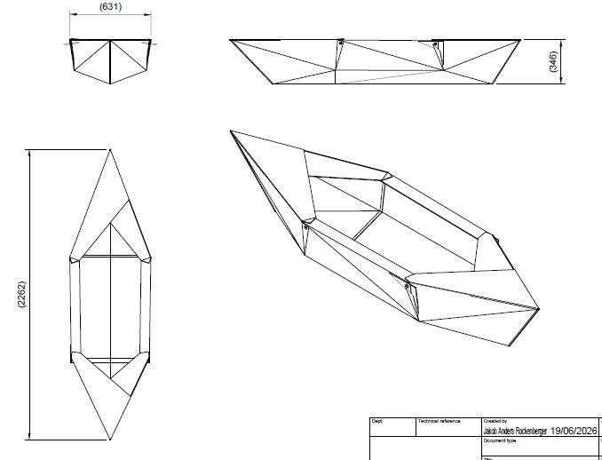

# But does it work?

Yes! We have made five thus far and tested them. The different versions have different quirks and fixes, see version log for details.

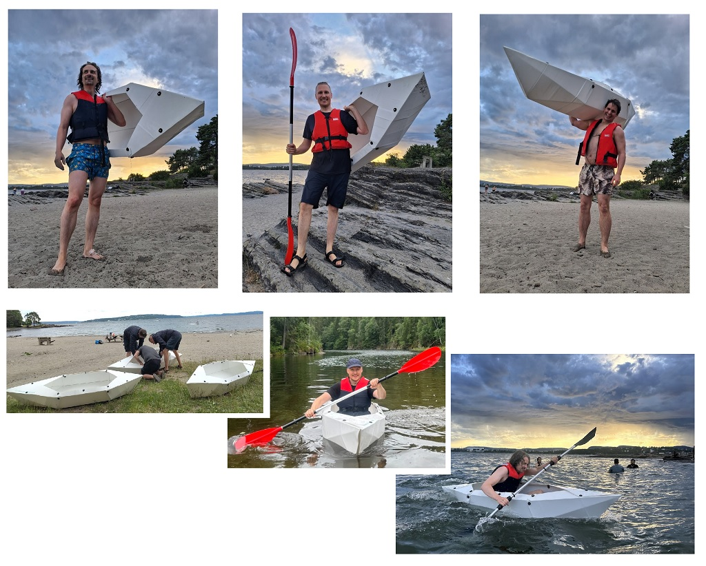

Tests at Paradisbukta and Østmarka, Oslo 2026.

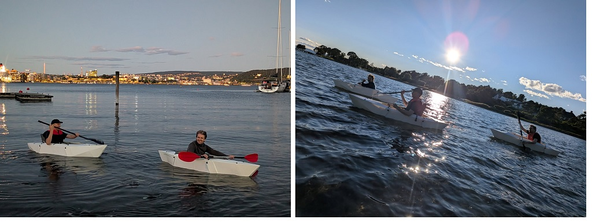

Restaurant trip to Lille Herbern, Oslo 2026.

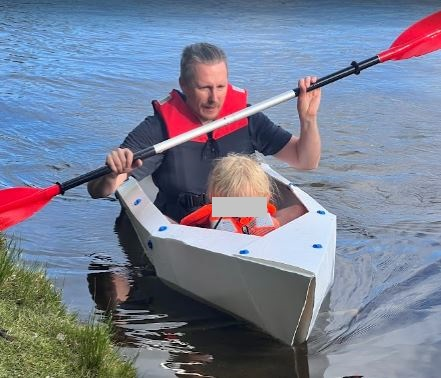

1-2 kids on board as ballast has been found to improve stablity

[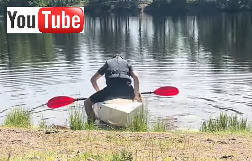](https://youtu.be/oQs99TTAEPQ?si=FxAfOIfxH4dqbu4J)

[First test video on Youtube](https://youtu.be/oQs99TTAEPQ?si=FxAfOIfxH4dqbu4J)

## Who? Where?
We are a group of five Makers based in Oslo Norway attempting to make, improve and share Aslags fantastic kayak design! 

We are working out of the shared workshop [Fellesverkstedet](https://www.fellesverkstedet.no/) and they have been incredibly helpful in procuring the materials needed for the project. 

We are also making use of Norways biggest Makerspace: [Bitraf](https://bitraf.no/), for 3D -printing the fasteners.

### Production log 

We have made make 5 kayaks out of 8 sheets of polypropylene. Updated 09.102.2026

| Sheet | Use | Status |
| ----- | --- | ------ |
| 1     |Seat for Kayak 1 + test| Done |
| 2     |Kayak 1 v2.2| Done |
| 3     |Kayak 2 v2.2| Done |
| 4     |Kayak 3 v2.2| Done |
| 5     |Kayak 4 v2.3| Done |
| 6     |Kayak 5 v2.3| Done |
| 7     |Seats for 2-3 v2.3| Done |
| 8     |Seats for 4-5 v2.3| Done |
| 9     | Spare| Planned autocrease experiment  |

Sheet 9 will be used to test the [autocreaser](autocreaser.md) 

## How to make folded kayaks

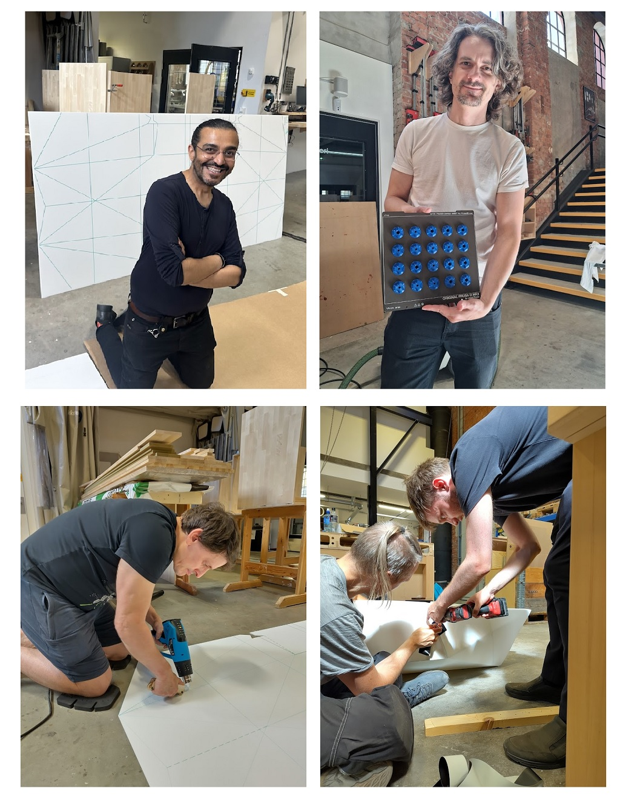

### Bill of materials, per kayak:
- 1.5pcs of 2440mm x 1220mm fluted / internally corrugated polypropylene sheet - 4mm thickness 700g/m^2 - 1.5pcs / Kayakk ([Antalis supplier](https://www.antalis.no/eshop/medier-og-utstyr-for-visuell-kommunikasjon/plater/kanalplast-pp-pdp-hq08108/sku-694530#))
- 14pcs of M6 hex head screws 30mm length 
- 14pcs of M6 nuts
- Filament for 3D printing 28 lock washers (we used PLA) 
- Gaffa tape for temporary assembly

### Tools:
- 3D-printer for printing lock washers
- Exacto knife for cutting plastic
- A pen and a ruler or a large CNC for marking the sheets
- Hot air gun, preferably one that can be set to 150C
- Hand held roller, Ø5-10mm wide ca Ø30mm diameter. Can be laser cut, 3D-printed or made from scrap. [Rihno files](Lasercut-creasing-tool/CreasingToolv1.3dm)
- Handheld drill and a Ø6-7mm drill bit

### Methodology

Preparations:
1. 3D-Print all the lock washers (print a test one first)
2. Push the screws and nuts into the 3D-prints 

Making the Kayaks:
1. Find a large open space to work in. 4m x 2m minimum.
1. Mark where you want to cut and fold your sheet
1. [Cut the small pieces away](Images/cut.jpg)
2. [Heat the plastic locally to 150C using the hot air gun and](Images/crease.jpg)
3. [Create creases along the lines using a roller](Images/crease.jpg) 
4. Use a board or something stiff under the sheet when you first it, to help establish straight folds
5. [Youtube video: Shape the kayak and fix it in place using gaffa tape](https://youtube.com/shorts/2akg2EgOliQ)
6. Drill the holes for the screws
8. Use the screws and nuts with the 3D printed lock washers to assemble the whole kayak

# Research

- A sheet metal model was developed, see [tests for establishing k-value and new approximated sheetmetal model](sheet_metal_theory.md)
- An [auto-creasing tool](autocreaser.md) is being developed.
- Test alternative sheets designs to the channeled one

## Alternative sheet test

- [Akyprint smooth 3.3mm 900g/m from VINK](https://vink.no/media/import/NO_Akyprint_Brosjyre.pdf), works great in small scale test!

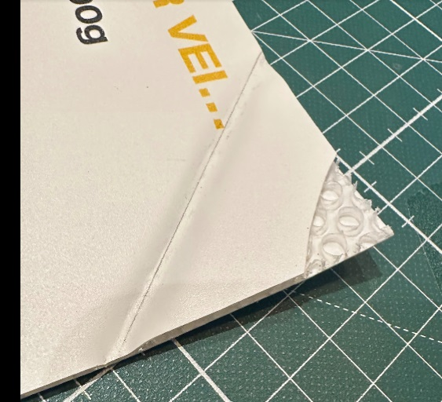

[See autocreaser for more tests](autocreaser.md)

## Todo

- Test [autocreaser](autocreaser.md) in CNC
- Test out low seats with backs like [Falkeberg Ground Chair](./Images/ground_chair.JPG)
- Develop version 3.0 of the folding kayak 

## Version 3 - Under development

Change log
- Introduces more angles to the first pack up lines, makes a rounder more complex shape. 

Next step:
- Make new paper tests 

Only tested in paper.

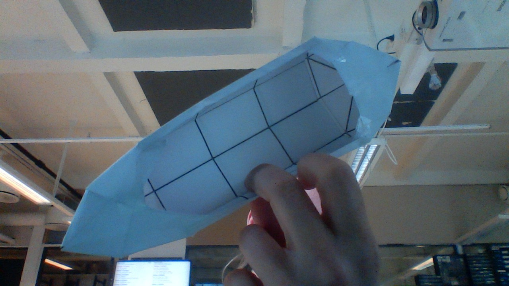

- [PDF drawing for A4 models](Drawings/V3_1Oct_double_top.pdf)

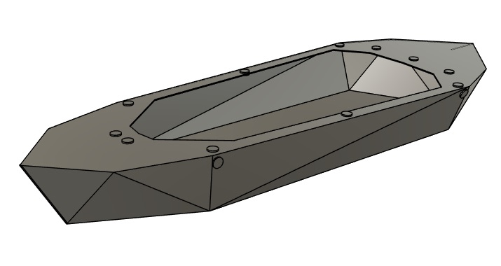

- [3D-model, web view](https://a360.co/4iS6Kz8) Including a comparison with v2 and a righting arm analysis setup

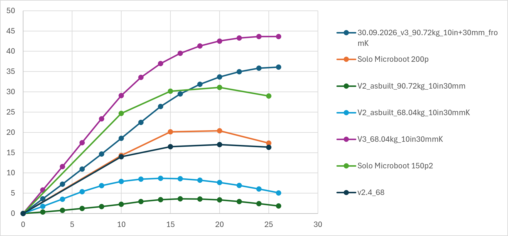

Righting arm vs Heel angle plot for different loads. Centre of gravity 254mm (10in = standard pilot assumption) + 30mm (assumed seat height) above keel.

- [Graph data CSV](Fusion360/TestData_v3_comp.csv)
- [Graph data Excel](Fusion360/RightingArmSweep_cleaned_plotted.xlsx)
- [Kayak stability therory](https://guillemot-kayaks.com/kayak-stability)
- [Solo Microbootlegger kayak](https://guillemot-kayaks.com/catalog/strip-built/recreational-kayak-solo/solo-microbootlegger) used as comparision

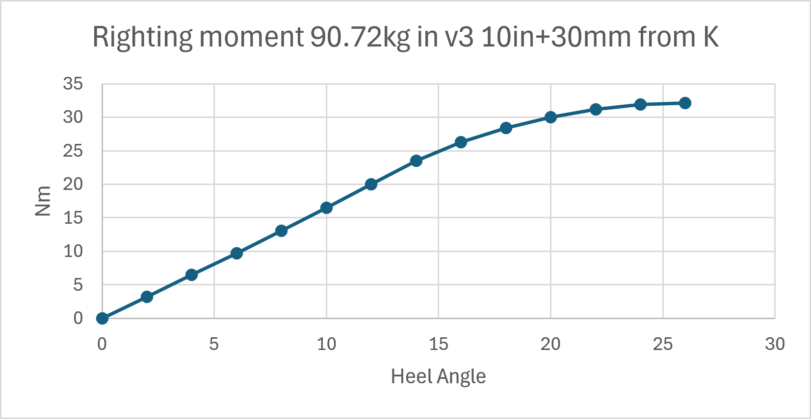

- [DXF pattern](Drawings/Simple_pattern_v3_top_lines.dxf)

# Version history and test log

## Version 2.3

The version we are currently making.

 These tweaks aim to stiffen the kayak further and avoid the innvards collapses. 
 
 - This update tries out several things, possibly overcomplicating the design. Some of these fixes might be enough on their own. 
 
### Change log 

- Extend the seat-inlay to use half a full sheet of polypropylene 1220X1220 = more bending, lots more dimensjons
- Move the "pack up lines" to intersect with other lines. 
- Slope the cockpit sides innward to make the bends sharper in the nose and rear. This means cutting more from the corners, how much? Freehand? possibly not needed? Can we achieve the same thing some other way?

### Drawings

PDF in work!

[JPG Seat v2.3](./Drawings/seat_v2.3_tested.jpg)

[PDF Brettekajakk v2.3 pack_up lines only](./Drawings/Brettekajakk_pack_up_lines_v2.3.pdf)

[DXF seat v2.3](./Router-plot-DXF/Seat_v2.3_DXF.dxf)

[DXF kayak main file v2.3](./Router-plot-DXF/Brettekayak_JR_v2.3.dxf)

### 3D-prints
- [1pcs-Lock-washers-folding-kayak-M6-Screw-holder.3mf](3D-print-3MF/1pcs-Lock-washers-folding-kayak-M6-Screw-holder.3mf)
- [28pcs-Lock-washers-folding-kayak-M6-Screw-holder.3mf](3D-print-3MF/28pcs-Lock-washers-folding-kayak-M6-Screw-holder.3mf)

## Version 2.25

This is using a v2.2 kayak main body and a v2.3 seat inlay.

### Test results and impressions

- The seat inlay v2.3 was a success! It stopped most of the inversions that v.2.2 suffered from. We don't know if this more complicated seat is strictly neccessary for version 2.3 kayaks but it gives more strength than 2.2 so it doesn't hurt.
- The ergonomics is still somewhat lacking. A backrest would be very nice for any longer trips. We have not tested the beach chair solution yet.
- The sides are rather high and wide, they can be pulled in front of the pilot to give better room to paddle. 
- The pilot has to sit almost in the very middle of the kayak with their feet in the tip for the kayak to float level in the water. There is room for improvement! We consider a more almond shaped design for version 3.0 with a wider back and narrow front. 
- [We have taped up the open edges of the sheet with silver-tape.](Images/taped.jpg) It can give it around 10 liters of trapped air for lift in an emergency and reduce cuts and scrapes. Especially on the sides of the cockpit.

## Version 2.2

### Test results and impressions

June 22 2026 - Jakob Rockenberger at Vesletjern

 It handles OK. Not fast not very rank or very stable. Tracks fine, not very fast. Survived some banging and grinding on rocks. Since it lacks sealed air chambers it's not something I'd risk the open seas with, but prefect for exploring a lake or a creek where you can swim to shore if you need it. The main advantage is that you can easily pack it up and take a bus home afterwards. I weigh 75kg and paddled easily around a small lake together with my 5 year old! 
 
 I sat on a foam mat with a rolled up towel underneath to let the boat keep the V shape in the bottom. We can possibly make a triangle from leftover material that we can use instead if we have enough. 

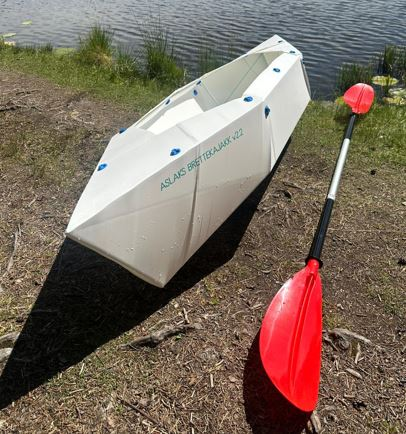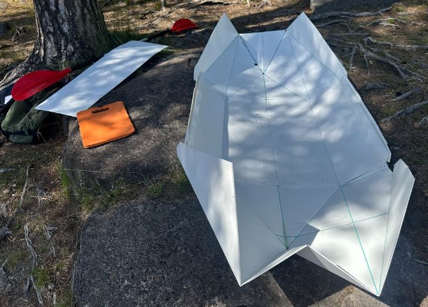

#### Inversions

- The kayak experienced some innvards local "collapses" of the shape of the Kayak, surfaces that should be convex became concave, when they were pushed in by the water-pressure. This happend in the bottom area under my calves and behind me from both sides. 
- Note that the kayak didn't become unsafe when this happened! When the bottom front inverted, the sideways stabiliy increased as well as the drag. I didn't notice the rear inverting until later, but I assume I lost some boyancy, forcing me to sit more to the front
- I think the reasons was the "pack up" folds, in this version they didn't intersect existing geometry. This can easily be changed in next version.
- Two more kayaks has already been creased with these unfortunate "pack up" folds, and we want to finish them regardless.
- Several potential fixes will be tested in version 2.3. 

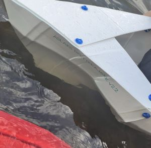

### Change log and notes

- The drawings now include previously missing and corrected dimesions for how much to cut off the corners.
- Bend lines for packing up (missing from the PDF drawing) are placed such a way in the DXF that it folds nice and small, around 400mm wide package.
- The bend lines for packing up appear to make it weaker. Consider moving them to natural intersection-points. 
- Was assembled and tested with vertical sides to the cockpit, it is possible that it would be stronger if they were curved in a bit. Intended in v2 original design?

### Drawings 

This is the drawing for version 2.3. Solid modeld recreated in Fusion360 by Jakob from Aslags drawings. 

[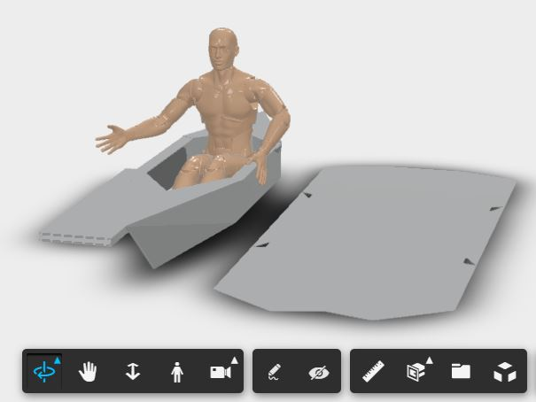](https://a360.co/4fWsus3)

[*Interactive 3d-model of the kayakk*](https://a360.co/4fWsus3)

[PDF Drawing for version 2.2, without "pack up lines"](./Drawings/Drawing_v2.2.pdf)

[DXF version, with "pack up bend lines"](./Router-plot-DXF/Brettekayak_JR_v2.2.dxf)

## Folding Kayak Aslagstyle - Brettekajakk Aslagstyle v1.0 and V2.0
Invented by [Aslag Guttormsgaard](https://www.instagram.com/aslagsbrettekajakk/) and shared with the public at [Oslo Skaperfestival 25. - 26. oktober 2025](https://deichman.no/aktuelt/oslo-skaperfestival-2025_D67nCl3o7T) ([Alt. link](https://skaperfestivalen.no/)). Attendies could fold their own mini kayaks from printouts on A4 paper. Aslag exibited his model 1 and 2 at the festival.

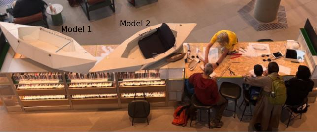

### Drawings 

#### Version 2.0 

This is the drawing for version 2.0. Changes from the previous version is that it has the added railing to rest your hands on. Don't mind that the text in the drawing says model 3.

[Drawing for version 2.0](./Drawings/Aslag_Kajakk_modell_2.pdf)

#### Version 1.0 

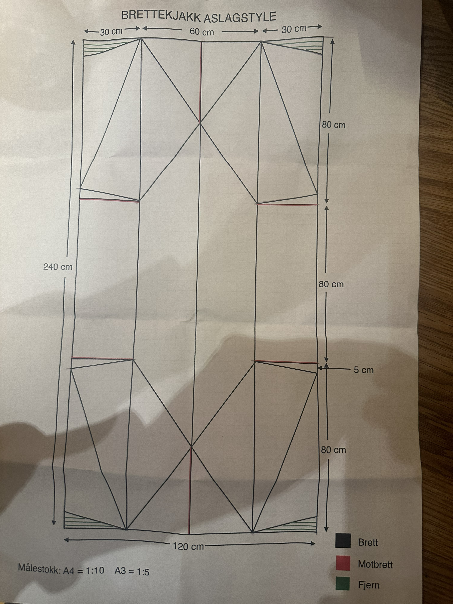

Paper handout of version 1.0 from Oslo Maker Festival

