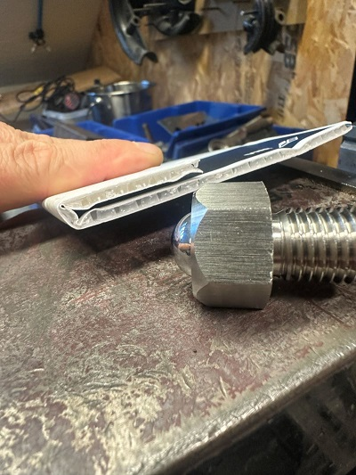
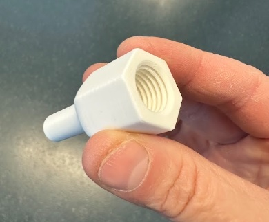
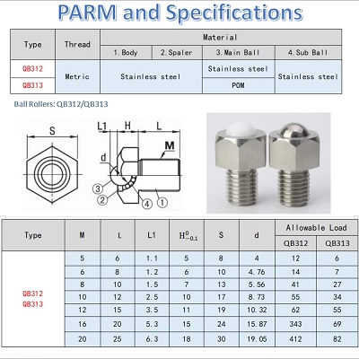
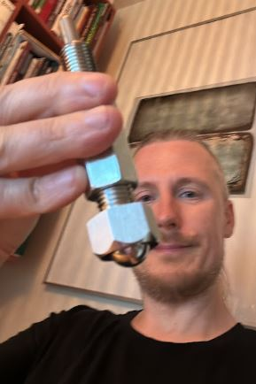
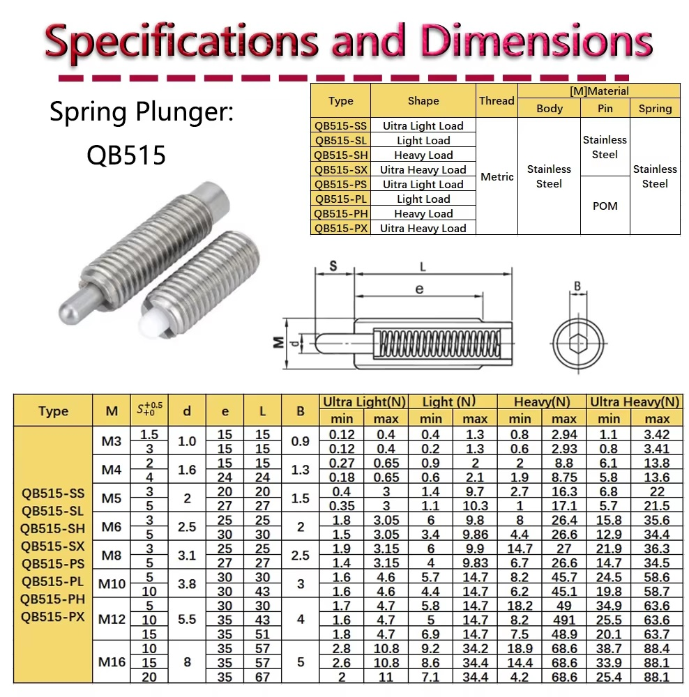

# Autocreaser for folding kayaks

The goal is to be able to use a large CNC machine to automate the creasing of polypropylene sheets when [folding kayaks.](./README.md)

Successfull test at [Bitraf](https://bitraf.no/)!

Sheet used: [Akyprint smooth 3.3mm 900g/m from VINK](https://vink.no/media/import/NO_Akyprint_Brosjyre.pdf) with a Ø16mm free rolling ball driven at a fixed height, no heat needed.

[Youtube short, autocrease test](https://youtube.com/shorts/zlMBDUQS9Cw)

## BOM
- Adapter for creasing ball [Fusion360](https://a360.co/4yF22JU) or [STL-file for printing](3D-print-STL/Adapter.stl)

The 3D-printed Ø12mm adapter can act as a break-away if we have ha catastrophic collison.

- Conveyor Ball Roller QB312, M16 from [Aliexpress](https://www.aliexpress.com/item/1005005415776359.html)

## Working principle 

- Mount Ø16mm ball with Ø12mm adapter in spindle collet on shopbot CNC
- Fix the sheet with tape
- Adjust the Z-offset to control the pressure on the sheet
- Crease one side at a time

## First prototype

The spring pin was not smooth enought when exposed to sideways forces.

- Ø8mm Steel spring pin QB515-SH, M16 [Aliexpress](https://www.aliexpress.com/item/1005006329455989.html)

