# Sheet metal approximation of corrugated plastic sheet in Fusion360

### Motivation
We wanted a more robus way to quickly visualise and generate "correct enough" drawings for new designs of the [folding kayaks.](./README.md)

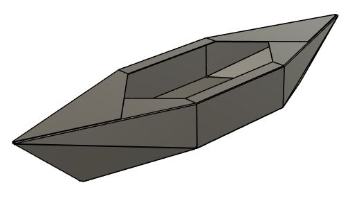

[*Link to Sheet metal model of kayak in Fusion 360*](https://a360.co/3T9g3j9)

### Results

Our investigations indicate that these were good enough values:

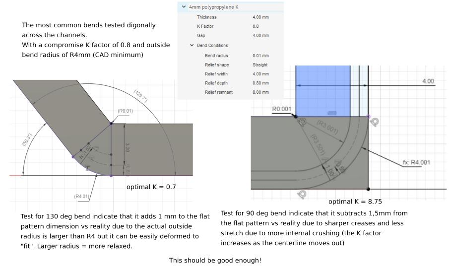

* K factor = 0.8
* Internal radius = 0.01
* Material thickness = 4
* External radius = 4.01

### Modeling stategy

1. Make 2D sketches defining all critical corners of a quarter of your kayak.
2. Patch them to a surface model, stitch together
3. Make a relief cut at all bend intersections. Revolve a half circle to cut with a sphere.
3. Add the internal radius to all bends
4. Thicken to a solid model
5. Convert the solid model to Sheet metal
6. Unfold and all bends, this adds them to the sheet metal model
7. Add and trim so that the unfolded model respects the sheet boundary
8. Refold
7. Generate flat pattern

Notes:

* Fusion doesn't like the 0.01 internal radius. A larger internal radius = more stable model, but will be less accurate.
* Break down the kayak into quarters for a more stable model. You can extrapolate the last bits.

## Folds to Bends theory

We know that the plastic sheet does not bend as a metal sheet does. The aim here is to find values that take us close enough.

### Metal sheet bending theory:

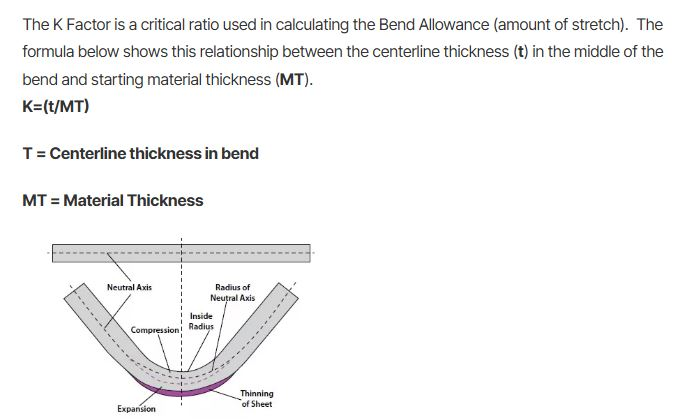

[Image from sendcutsend.com](https://sendcutsend.com/blog/what-is-k-factor-in-bending-terminology/).

### Plastic sheet bending experiments

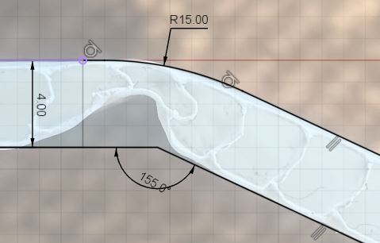
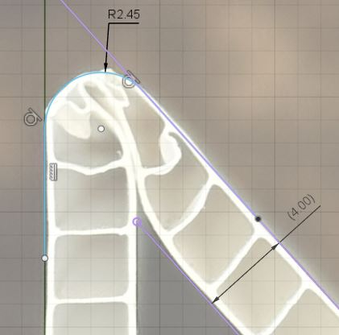
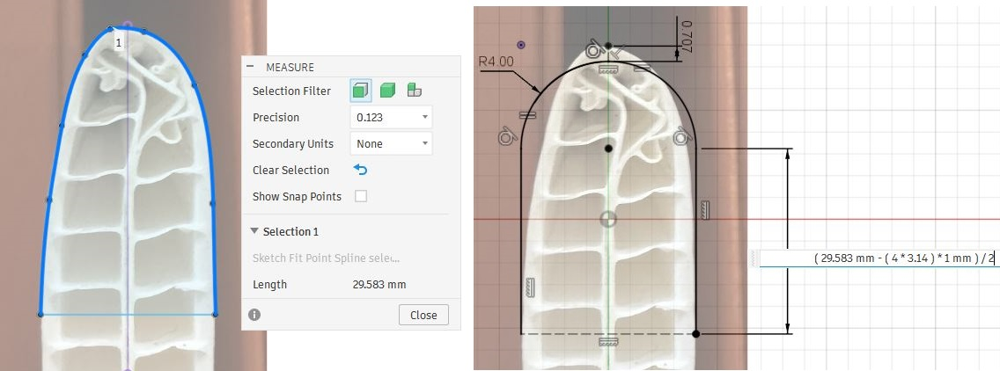
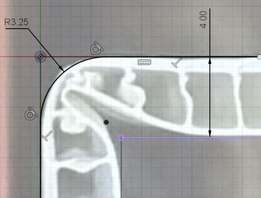
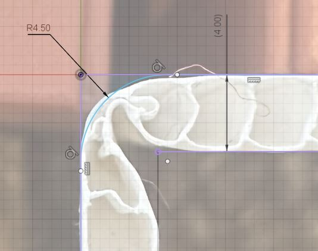

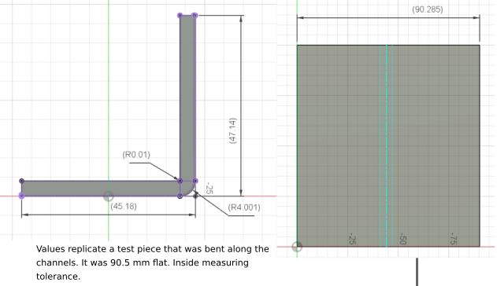
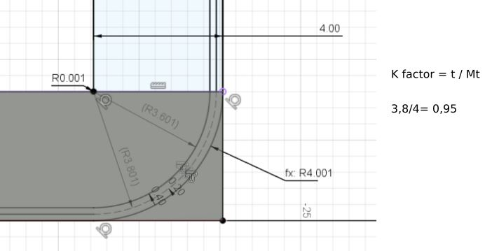

Bends along the channel should use even higher k factors. Here is a test which indicate k factor =0,95 would worsk for 90 deg bends made along the channels.

#### Observations and conclusions

* Sharper folds = sharper outside radius. Past the point of what is possible to simulate with sheet metal. Meaning we will use the smallest possible inside radius to get as close as we can.
* The K-factor varies with how deep the inside layer crushes into the fold, which is dependent on fold sharpness and channel angle. In the end I had to pick something represenatative.
* Further testing, to be scientific, would be showing "the negative" what happens when the k-faktor/radius is wrong, how bad does it get?
* But this should be enough to move forward with.

### Material properties

The kayaks are built from thin sheets of polypropylene. 

- 4 mm thick plates
- Channels with square cross-sections
- Approximate 0.2mm actual material thickness around and between channels

[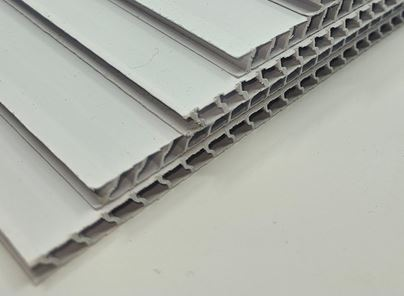](https://www.antalis.no/eshop/medier-og-utstyr-for-visuell-kommunikasjon/plater/kanalplast/kanalplast-pp/pdp-hq08108#)
 

